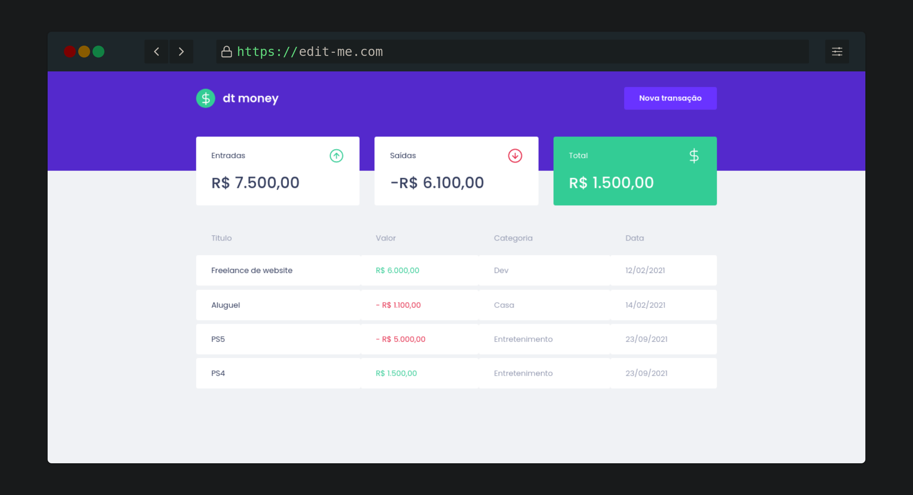

<br>

## Sobre o dt money

O dt money é uma alternativa simples e rápida para gerenciar suas finanças, cadastrando entradas, saídas e a organização em categorias.


<p align="center">
  
</p>

## Tecnologias

Tecnologias e ferramentas utilizadas no desenvolvimento do projeto:

- [React](https://reactjs.org/)
- [TypeScript](https://www.typescriptlang.org/)
- [Styled Components](https://styled-components.com/)
- [MirageJS](https://miragejs.com/)
- [Axios](https://github.com/axios/axios)
- [Polished](https://polished.js.org/)

<br>

## Instalação e uso

```bash
# Abra um terminal e clone o repositório
git clone https://github.com/erikalbuquerque/dtmoney.git

# Entre no diretório
cd dtmoney

# Instale as dependências
yarn

# Rode a aplicação
yarn start
```

<br>

Feito com :green_heart: by [Érik Albuquerque](https://github.com/erikalbuquerque)

<left>
  <h4>You can find me around here:</h4>

[](https://www.linkedin.com/in/erik-albuquerque/)
[](mailto:erik.albuquerque.oficial@gmail.com)
<a href="https://www.instagram.com/albuquerik">

</a>
<a href="https://app.rocketseat.com.br/me/erik-albuquerque">

</a>

</left>
